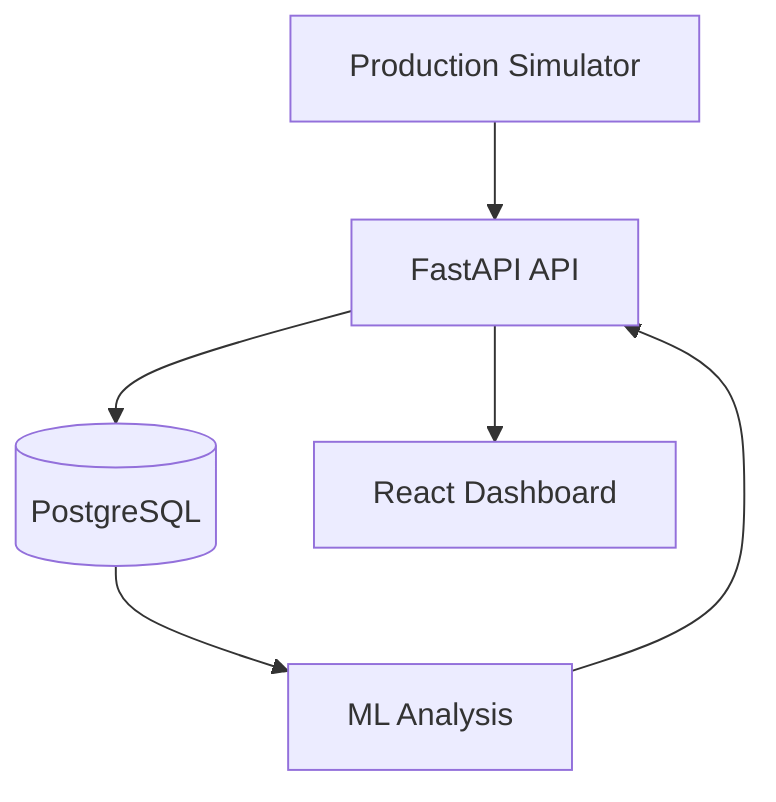

# FactoryPulse

AI-powered manufacturing quality and contributing-factor analysis platform for simulated PCB production lines.

## Problem

End-of-line tests identify defective PCBs, but they do not automatically explain which process conditions, machines, shifts, or material lots are associated with rising defect risk. FactoryPulse connects production events with quality results to:

- trace every PCB across manufacturing stages;
- detect abnormal machine/process behavior;
- estimate the probability of a future quality-test failure;
- rank the factors that contributed most to a prediction;
- surface actionable alerts in a web dashboard.

FactoryPulse is a decision-support system. It does not replace AOI, ICT, functional testing, or engineering judgment, and it does not claim causal proof from observational data.

## Three-week MVP

1. Synthetic PCB production simulator with planted fault scenarios.
2. FastAPI modular-monolith backend and PostgreSQL database.
3. React + TypeScript operations dashboard.
4. PCB traceability and machine monitoring.
5. Isolation Forest anomaly detection.
6. Logistic Regression baseline and gradient-boosted quality-risk model.
7. Prediction explanations and automatic alerts.
8. Dockerized local environment, automated tests, CI, deployment, and documentation.

## Architecture



The MVP starts as a modular monolith. Kafka, Kubernetes, computer vision, and separate microservices are explicitly out of scope for the first three weeks.

## Planned technology stack

- Frontend: React, TypeScript, Vite, Tailwind CSS, TanStack Query, Recharts
- Backend: Python, FastAPI, Pydantic, SQLAlchemy, Alembic
- Data: PostgreSQL, Pandas, NumPy
- ML: scikit-learn, XGBoost or LightGBM, SHAP, MLflow
- Quality: Pytest, Playwright, Ruff, ESLint
- Delivery: Docker Compose, GitHub Actions

## Repository structure

```text
FactoryPulse/
├── backend/          # FastAPI application (Day 2+)
├── frontend/         # React application (Week 2)
├── ml/               # Training, evaluation and inference code
├── data/             # Generated-data documentation; datasets are ignored
├── docs/             # Product and engineering decisions
├── .env.example
├── docker-compose.yml
└── README.md
```

## Getting started

Day 1 contains product and architecture definitions. The first runnable dependency is PostgreSQL:

```bash
cp .env.example .env
docker compose up -d db
```

Application startup commands will be added when the backend and frontend are implemented.

## Documentation

- [Problem definition](docs/problem-definition.md)
- [Functional and non-functional requirements](docs/requirements.md)
- [Architecture](docs/architecture.md)
- [Initial data model](docs/database-design.md)
- [Architecture decision record](docs/adr-001-modular-monolith.md)
- [Three-week backlog](docs/backlog.md)
- [Day 1 completion record](docs/day-01.md)

## Current status

Day 1 complete: scope, system boundaries, architecture, initial domain model, risk register, acceptance criteria, and implementation backlog are defined.

