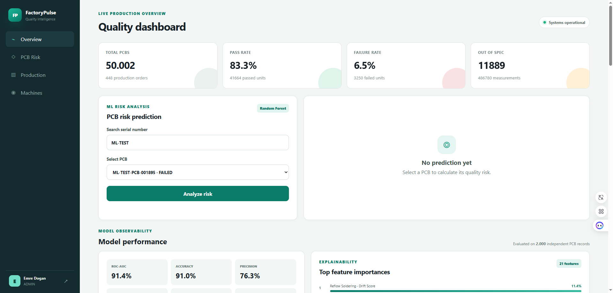
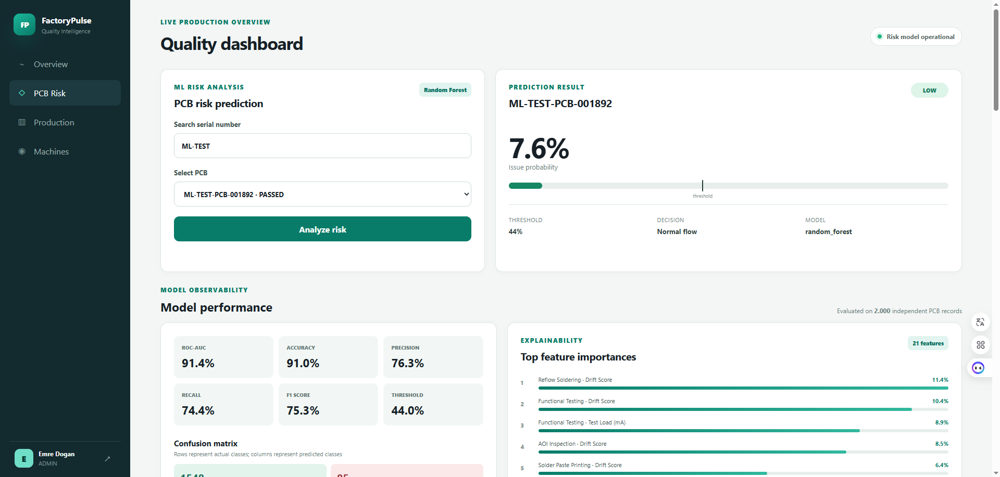
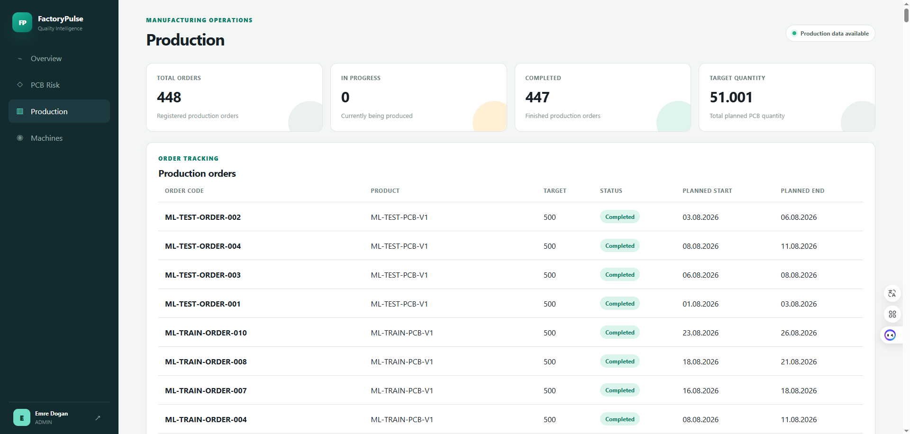
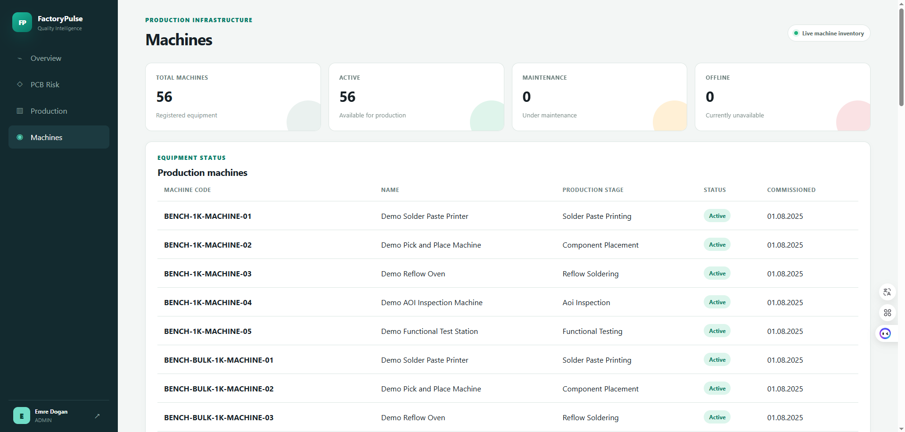
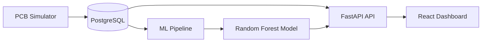

# FactoryPulse

FactoryPulse is an end-to-end manufacturing quality intelligence platform for simulated PCB production lines. It combines production traceability, process analytics and machine learning to estimate PCB quality risk before final inspection.

> FactoryPulse is a decision-support project built with synthetic manufacturing data. It does not replace AOI, functional testing or engineering judgment.
## Dashboard

### Quality Overview



### PCB Risk Analysis



### Production Monitoring



### Machine Monitoring



## Features

- PCB production data simulation
- Production order and machine tracking
- Process-event and quality-measurement storage
- JWT-based authentication and role-based access
- PCB-level quality-risk prediction
- Prioritized inspection queue
- Machine degradation analysis
- Material-lot and shift analysis
- Model performance and feature-importance dashboard
- Dockerized frontend, backend and PostgreSQL services
- Automated backend and frontend CI checks

## Problem

End-of-line testing identifies defective PCBs, but it does not automatically explain which process conditions are associated with increased quality risk.

FactoryPulse combines:

- production orders;
- PCB traceability;
- machine and process parameters;
- material lots;
- work shifts;
- machine degradation;
- quality measurements.

The resulting dataset is used to estimate issue probability and prioritize PCBs that may require additional inspection.

## Architecture



FactoryPulse is implemented as a modular monolith. The backend owns authentication, domain APIs, analytics and model inference. The React frontend accesses the backend through an Nginx reverse proxy.

## Technology Stack

### Backend

- Python 3.10
- FastAPI
- Pydantic
- SQLAlchemy
- PostgreSQL
- JWT authentication
- Pytest

### Machine Learning

- pandas
- NumPy
- scikit-learn
- Logistic Regression
- Random Forest
- joblib

### Frontend

- React
- TypeScript
- Vite
- React Router
- Axios
- Vitest
- Testing Library
- ESLint
- Nginx

### Delivery

- Docker
- Docker Compose
- GitHub Actions

## Machine Learning Results

The selected Random Forest model was evaluated on an independent synthetic test dataset containing 2,000 PCB records.

| Metric | Result |
|---|---:|
| Accuracy | 91.05% |
| Precision | 76.26% |
| Recall | 74.39% |
| F1 Score | 75.31% |
| ROC-AUC | 91.38% |
| Decision threshold | 0.44 |

Confusion matrix:

| | Predicted Passed | Predicted Issue |
|---|---:|---:|
| Actual Passed | 1548 | 85 |
| Actual Issue | 94 | 273 |

The decision threshold was selected to improve issue recall while maintaining useful precision.

Important model signals include:

- process drift scores;
- Reflow oven parameters;
- functional-test parameters;
- thermal stress;
- machine degradation;
- material lot;
- production shift.

## Synthetic Data Scenarios

The simulator plants controlled relationships in the generated dataset:

- night-shift risk increase;
- problematic solder-paste lot;
- progressive Reflow machine degradation;
- process-parameter drift;
- combined oven-temperature and conveyor-speed interaction.

These relationships make it possible to test whether the model learns meaningful manufacturing-risk patterns.

## Application Pages

| Route | Description |
|---|---|
| `/` | Production quality overview |
| `/pcb-risk` | PCB risk prediction and inspection queue |
| `/production` | Production order monitoring |
| `/machines` | Machine inventory and operational status |
| `/docs` | Backend Swagger documentation on port 8000 |

## Repository Structure

```text
FactoryPulse/
├── backend/              # FastAPI application and tests
├── frontend/             # React and TypeScript dashboard
├── ml/                   # Training, evaluation and model artifacts
├── data/                 # Generated-data documentation
├── docs/                 # Architecture and project decisions
├── .github/workflows/    # Continuous integration
├── .env.example          # Environment-variable template
├── docker-compose.yml
└── README.md
```

## Quick Start with Docker

### Requirements

- Docker Desktop
- Docker Compose

### 1. Configure environment variables

From the repository root:

```powershell
Copy-Item .env.example .env
```

Update the secret and local database password values in `.env`.

### 2. Start the application

```powershell
docker compose up -d --build
```

Check service health:

```powershell
docker compose ps
```

Expected services:

- `factorypulse-db-1`
- `factorypulse-backend-1`
- `factorypulse-frontend-1`

### 3. Create an administrator

```powershell
docker compose exec backend `
    python -m scripts.create_admin `
    --email admin@factorypulse.dev `
    --full-name "FactoryPulse Admin"
```

The command securely requests the administrator password.

### 4. Generate demo production data

```powershell
docker compose exec backend `
    python -m scripts.seed_demo_data `
    --prefix DEMO `
    --orders 5 `
    --pcbs-per-order 100 `
    --seed 42
```

Use a new prefix for each independent dataset.

### 5. Open the application

- Frontend: http://localhost:5173
- Swagger UI: http://localhost:8000/docs
- Backend health: http://localhost:8000/health
- Frontend health: http://localhost:5173/health

Stop the services without deleting database data:

```powershell
docker compose down
```

Do not use `docker compose down -v` unless you intentionally want to delete the PostgreSQL volume.

## Local Development

### Backend

```powershell
cd backend

python -m venv .venv
.\.venv\Scripts\Activate.ps1

python -m pip install --upgrade pip
python -m pip install -r requirements.txt

python -m alembic upgrade head
uvicorn app.main:app --reload
```

The backend runs at http://localhost:8000.

### Frontend

Open another terminal:

```powershell
cd frontend
npm install
npm run dev
```

The development frontend runs at http://localhost:5173.

## Reproducing the ML Model

The trained `.joblib` model is intentionally not tracked in Git. It can be reproduced from generated synthetic data.

### 1. Generate training data

Start PostgreSQL, then run from `backend`:

```powershell
python -m scripts.seed_demo_data `
    --prefix ML-TRAIN `
    --orders 10 `
    --pcbs-per-order 500 `
    --seed 2026
```

### 2. Export the PCB-level dataset

```powershell
python -m scripts.export_ml_dataset `
    --prefix ML-TRAIN `
    --output ..\ml\data\ml_train.csv
```

### 3. Train the Random Forest model

Run from the `ml` directory:

```powershell
python .\train_random_forest.py `
    --dataset .\data\ml_train.csv `
    --model-output .\models\enhanced_random_forest.joblib `
    --minimum-recall 0.80
```

The generated model path is:

```text
ml/models/enhanced_random_forest.joblib
```

Restart the backend after generating or replacing the model:

```powershell
docker compose restart backend
```

## Data Analysis

Analyze a generated dataset from the `backend` directory:

```powershell
python -m scripts.analyze_demo_data `
    --prefix ML-TRAIN
```

The report compares:

- day and night shifts;
- material lots;
- healthy and degraded machine periods;
- Reflow thermal-stress behavior.

## API Overview

Main API groups:

- `/api/v1/auth`
- `/api/v1/users`
- `/api/v1/machines`
- `/api/v1/production-orders`
- `/api/v1/pcb-units`
- `/api/v1/process-events`
- `/api/v1/quality-measurements`
- `/api/v1/analytics`

Complete request and response contracts are available through Swagger UI.

## Testing

### Backend

```powershell
cd backend
python -m pytest -q
```

Current backend suite:

```text
124 passed
```

### Frontend

```powershell
cd frontend
npm run test
npm run lint
npm run build
```

Current frontend suite:

```text
8 passed
```

## Continuous Integration

GitHub Actions automatically runs on pushes and pull requests targeting `main`.

The workflow performs:

- PostgreSQL service startup;
- backend dependency installation;
- database migrations;
- backend tests;
- frontend dependency installation;
- frontend tests;
- ESLint validation;
- production frontend build.

## Model Limitations

- All manufacturing records are synthetic.
- Reported metrics do not represent performance in a real factory.
- Feature importance shows predictive association, not causation.
- Production use would require real data validation, monitoring and periodic retraining.
- The model is intended to prioritize inspection, not replace existing quality-control stages.

## Project Status

Implemented:

- Backend domain APIs
- PostgreSQL data model
- Authentication and authorization
- Synthetic PCB simulator
- ML dataset export
- Logistic Regression baseline
- Random Forest training and evaluation
- PCB risk inference API
- React operations dashboard
- Production and machine pages
- Docker Compose environment
- Automated tests and CI

Planned improvements:

- Pagination and advanced filtering
- Production-order and machine detail pages
- Model-version tracking
- Prediction-history storage
- Monitoring and retraining workflow
- Cloud deployment

## License

This project was developed for educational and portfolio purposes.