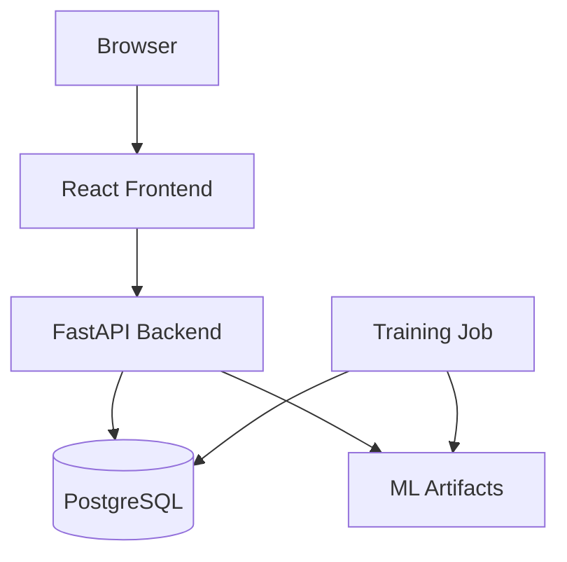

# Architecture

## Architectural style

FactoryPulse begins as a modular monolith with clear internal boundaries. This reduces operational overhead during the MVP while preserving an extraction path for simulator, training, or inference workloads later.

## Runtime containers



MLflow will be added in Week 3 as experiment metadata and model lifecycle infrastructure. It is not required for the first vertical slice.

## Backend modules

| Module | Responsibility |
| --- | --- |
| Identity | Authentication, roles, current user |
| Production | Orders, PCBs, stages, process events |
| Assets | Lines and machines |
| Materials | Material lots used by production events |
| Quality | Tests, outcomes, and defect types |
| Analytics | Aggregated dashboard queries |
| Intelligence | Anomaly/risk inference and explanations |
| Alerts | Threshold evaluation and acknowledgement |
| Simulator | Reproducible synthetic production streams |

Modules communicate through service interfaces inside one backend process. HTTP handlers do not directly contain SQL queries or ML preprocessing.

## Data flow

1. Simulator creates a production order and PCB identifiers.
2. Simulator emits a sequence of process events for each PCB.
3. Events are validated and persisted through production services.
4. Quality outcomes are generated after the final stage.
5. Feature builders create leakage-safe inference records.
6. Models return anomaly/risk outputs and model metadata.
7. Predictions and explanations are persisted.
8. Alert rules evaluate stored predictions.
9. Dashboard endpoints return operational summaries and traceability details.

## API conventions

- Base path: `/api/v1`
- JSON property naming: `snake_case`
- Timestamps: UTC ISO 8601
- IDs: UUID for domain entities; stable human-readable codes for display
- Pagination: `page`, `page_size`, `total`, `items`
- Errors: machine-readable `code`, user-readable `message`, optional `details`

Example error:

```json
{
  "error": {
    "code": "PCB_NOT_FOUND",
    "message": "The requested PCB does not exist.",
    "details": {"pcb_code": "PCB-2026-00124"}
  }
}
```

## Security boundaries

- Password hashes only; passwords are never stored or logged.
- JWT access tokens are short-lived.
- Role checks occur in the backend, never only in the UI.
- Secrets are provided through environment variables.
- Simulator control requires Admin role.
- Model files are loaded from trusted application artifacts, not user uploads.

## ML boundaries

- Training and online inference share a versioned feature definition.
- Every prediction stores model name and version.
- Time-based evaluation is preferred over random splitting.
- Explanations describe model contributions, not causal effects.
- Quality outcomes and post-test attributes cannot be prediction inputs.

## Future extraction path

Only after the MVP demonstrates need:

- simulator events can move to a message broker;
- model training can become a scheduled worker;
- inference can become an independent service;
- time-series metrics can move to specialized storage;
- deployments can move from Compose to an orchestrator.

