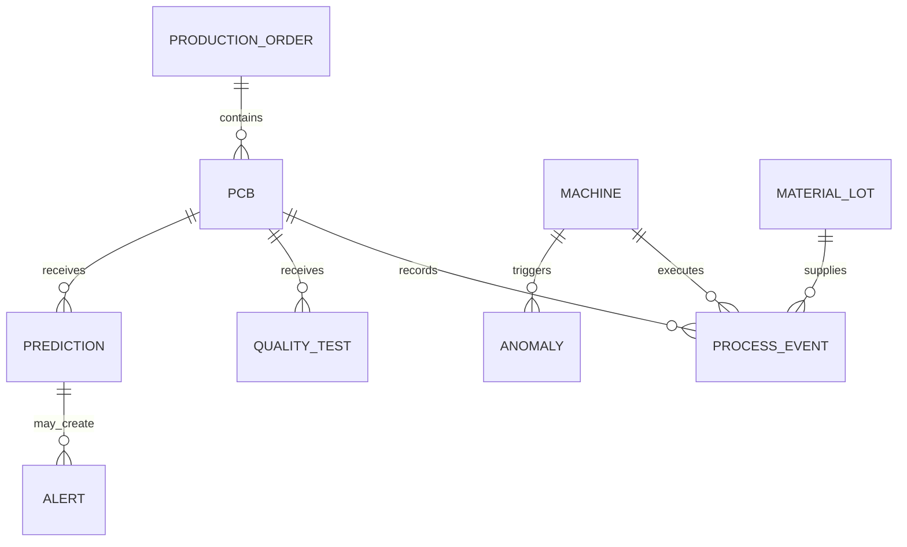

# Initial Data Model

This is a logical Day 1 design. Exact column types and indexes will be finalized with SQLAlchemy models and Alembic migrations.

## Entity relationship overview

## Core entities

### users

- `id`: UUID primary key
- `email`: unique, normalized
- `password_hash`
- `role`: ADMIN, QUALITY_ENGINEER, VIEWER
- `is_active`
- `created_at`, `updated_at`

### machines

- `id`: UUID primary key
- `machine_code`: unique display identifier
- `name`
- `stage_type`
- `status`: ACTIVE, MAINTENANCE, OFFLINE
- `commissioned_at`
- `created_at`, `updated_at`

### production_orders

- `id`: UUID primary key
- `order_code`: unique display identifier
- `board_type`
- `planned_quantity`
- `status`: PLANNED, RUNNING, COMPLETED, CANCELLED
- `started_at`, `completed_at`

### pcbs

- `id`: UUID primary key
- `pcb_code`: unique and indexed
- `production_order_id`: foreign key
- `serial_number`: unique
- `current_stage`
- `status`: IN_PRODUCTION, PASSED, FAILED, SCRAPPED
- `manufactured_at`

### process_events

- `id`: UUID primary key
- `pcb_id`: foreign key and indexed
- `machine_id`: foreign key and indexed
- `material_lot_id`: nullable foreign key
- `stage_type`
- `sequence_number`
- `shift`: DAY, EVENING, NIGHT
- `started_at`, `completed_at`
- `cycle_time_seconds`
- `temperature_celsius`: nullable
- `humidity_percent`: nullable
- `conveyor_speed_mpm`: nullable
- `placement_accuracy_mm`: nullable
- `solder_paste_thickness_um`: nullable
- `raw_measurements`: JSON for non-MVP measurements

### material_lots

- `id`: UUID primary key
- `lot_code`: unique
- `material_type`
- `supplier_code`
- `received_at`
- `expires_at`

### quality_tests

- `id`: UUID primary key
- `pcb_id`: foreign key and indexed
- `test_type`: AOI, ICT, FUNCTIONAL
- `result`: PASS, FAIL
- `defect_type`: nullable
- `measured_at`
- `notes`: nullable

### predictions

- `id`: UUID primary key
- `pcb_id`: foreign key and indexed
- `model_name`
- `model_version`
- `failure_probability`
- `risk_level`: LOW, MEDIUM, HIGH, CRITICAL
- `top_factors`: JSON
- `created_at`

### anomalies

- `id`: UUID primary key
- `process_event_id`: foreign key
- `machine_id`: foreign key and indexed
- `model_name`
- `model_version`
- `anomaly_score`
- `severity`
- `anomalous_features`: JSON
- `created_at`

### alerts

- `id`: UUID primary key
- `alert_type`
- `severity`
- `title`, `message`
- `machine_id`: nullable foreign key
- `pcb_id`: nullable foreign key
- `prediction_id`: nullable foreign key
- `status`: OPEN, ACKNOWLEDGED, CLOSED
- `created_at`, `acknowledged_at`

## Initial indexes

- `pcbs(pcb_code)` unique
- `process_events(pcb_id, sequence_number)` unique
- `process_events(machine_id, started_at)`
- `quality_tests(pcb_id, measured_at)`
- `predictions(pcb_id, created_at)`
- `anomalies(machine_id, created_at)`
- `alerts(status, severity, created_at)`

## Data-integrity rules

- Probabilities must be between 0 and 1.
- Humidity must be between 0 and 100.
- Event completion cannot precede event start.
- Stage sequence numbers must be positive.
- A failed quality test should include a defect type in generated MVP data.
- Prediction features must be available before the predicted quality outcome.

